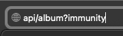
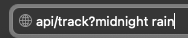
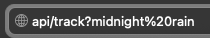
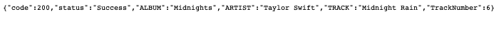

**Spotify API Wrapper**

Available Endpoints: <br>
**• album** <br>
**• track**

url: ```api/<endpoint>?<query>```

**Example Query** <br>

• Album


• Track
Note: replace spaces with ```%20``` <br>

❌ incorrect: 
 <br>
✅ correct: 
 <br>
 
**Album Query Results** <br>
 <br>

**Track Query Results** <br>

